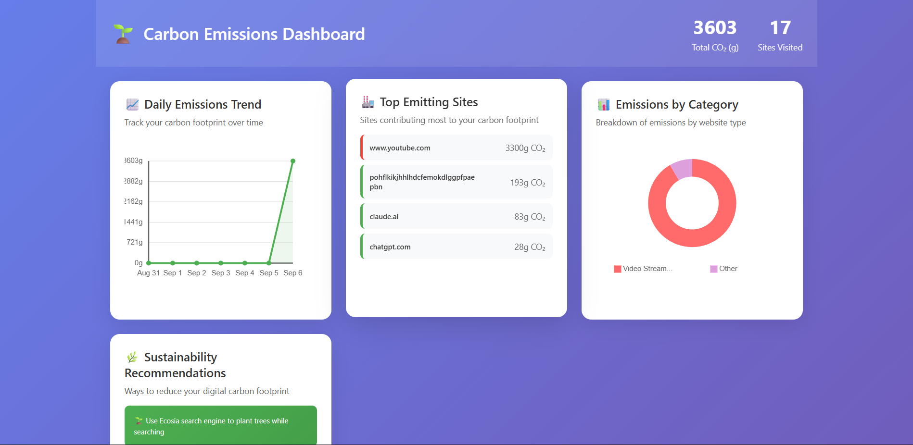

# 🌍 Carbon Emissions Tracker – Chrome Extension

---

## 📸 Screenshots

  
  

---

## ℹ️ About the Extension

A Chrome extension that tracks and visualizes the **carbon footprint of your web browsing**.  
Based on research, downloading **1 GB of data from the internet emits ~11 grams of CO₂**.  
This extension calculates emissions in real time as you browse and helps you make **greener choices online**.  

---

## 🚀 Features

- ✅ Calculate **carbon footprint** based on data sent/received when visiting websites  
- ✅ Show the **expected CO₂ emissions per site/session**  
- ✅ Track **all-time emissions history** for the user  
- ✅ Categorize websites as **Green, Semi-Green, Non-Green**  
- ✅ Recommend alternative websites with a **lower footprint but similar functionality**  
- ✅ Suggest network upgrades if packet loss is high  
- ✅ Simple, lightweight, and privacy-friendly (all processing is local)  

---

## 🖥️ Installation & Testing

### 1. Clone the Repository
```bash
git clone https://Rohitthakan/carbon-emissions-tracker.git
cd carbon-emissions-tracker
```

### 2. Load Extension in Chrome
Open Google Chrome and go to:
- chrome://extensions/
- Enable Developer mode (toggle in the top right corner).
- Select the project folder you just cloned.
- The extension will now appear in your Chrome toolbar 🎉.

### 3. Test the Extension
Open the extension popup to view:
- 📊 Current session emissions
- 🕒 All-time emissions history
- 🌱 Website categorization (Green, Semi-Green, Non-Green)

Try visiting heavy websites (e.g., video streaming, image-heavy sites) vs lightweight websites to see the difference.
